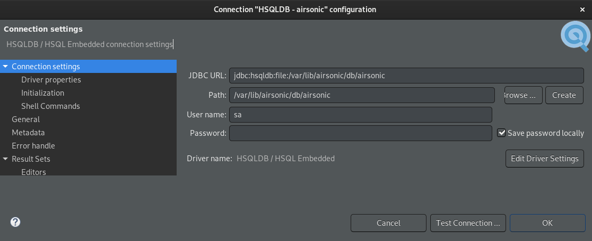

## Configure an external Database

Airsonic is built with generic ANSI SQL (for the most part) and uses [Liquibase](http://www.liquibase.org/) for database migrations in a database agnostic way and should be able to run against a variety of databases. However, not all databases have been verified to work and you may run into issues with the liquibase migrations or runtime SQL issues. Here is a list of community tested setups:

| Database   | Version | Liquibase | Runtime | Notes  |
|:----------:|:-------:|:---------:|:-------:|:------:|
| HyperSQL   | 1.8     | ✔         | ✔       | Default|
| HyperSQL   | 2.X     | ✕         | ✕       | No curent plans to support, look into SQLite instead? |
| PostgreSQL | 9.5     | ✔         | ✔       |        |
| MariaDB    | 10.2    | ✔         | ✔       | Lower version is possible by tuning mariadb options |
| MySQL      | 5.7.17  | ✔         | ✔       |        |

If you wish to continue using the current hsql 1.8 database driver, no action is needed. If you wish to use another database, read on.


## Database configuration

**Before doing anything, make sure your database is properly backed up. Ensure your server is shutdown**

For those that wish to change their database, instructions differ based on
whether you wish for your database connection to be managed by your container (tomcat), or whether you wish Airsonic to manage it for you. The former may offer some performance gains in the case of many concurrent users with connection pooling while the latter is easiest.

We will refer to container managed configuration as jndi and airsonic managed configuration as embedded.

## Embedded

**Before doing anything, make sure your database is properly backed up. Ensure your server is shutdown**

In your airsonic.properties file, you will need to add the following settings (this is just an example):

```
DatabaseConfigType=embed
DatabaseConfigEmbedDriver=org.hsqldb.jdbcDriver
DatabaseConfigEmbedUrl=jdbc:hsqldb:file:/tmp/libre/db/airsonic
DatabaseConfigEmbedUsername=sa
DatabaseConfigEmbedPassword=
```

In addition, you will need to ensure that a jdbc driver suitable for your database is on the [classpath](https://docs.oracle.com/javase/8/docs/technotes/tools/windows/classpath.html).

**Note: adding to the classpath is currently pretty difficult for spring-boot. Tomcat is easy, just copy into tomcat home /lib. TODO: provide prebuilt artifacts with tested databases built in?**

## JNDI

**Before doing anything, make sure your database is properly backed up. Ensure your server is shutdown**

In your airsonic.properties file, you will need to add the following settings (this is just an example):

```
DatabaseConfigType=jndi
DatabaseConfigJNDIName=jdbc/airsonicDB
```

Then in your context.xml in your tomcat directory, add the jndi config:

```
<Resource name="jdbc/airsonicDB" auth="Container"
    type="javax.sql.DataSource"
    maxActive="20"
    maxIdle="30"
    maxWait="10000"
    username="airsonic"
    password="REDACTED"
    driverClassName="com.mysql.jdbc.Driver"
    url="jdbc:mysql://hostname/airsonic?sessionVariables=sql_mode=ANSI_QUOTES"/>

```

Finally, copy the jdbc driver from the database vendor website to the `lib` directory in your tomcat folder.

## Database Vendor Specific Notes

### PostgreSQL

`stringtype=unspecified` on your jdbc url string is necessary.

You will also need to add `DatabaseUsertableQuote="` to your properties file. This is due to the fact that our `user` table is a keyword for postgres.

### HSQLDB

Unless a different database is configured, the default internal HSQLDB database
is stored in multiple files in the `$(airsonic.home)/db` directory.

> **NOTE**: It is heavily recommended to operate on a copy of the database (the
> entire `db` directory) unless write access is needed, because modern HSQLDB
> versions (2+) will *automatically* upgrade the database format, making it
> unreadable to Airsonic.

The database can be accessed using tools such as
[DBeaver](https://dbeaver.io/), by providing the `sa` username and no password:



In addition to that, the HSQLDB distribution provides a command-line tool that
can be used to automate some tasks. Download [HSQLDB
1.8.1](https://sourceforge.net/projects/hsqldb/files/hsqldb/hsqldb_1_8_1/)
(SHA256 checksum is
c3669bbebcb5c722b273f20c316af744d4e263bc90cc20fd1e6296dff7cc3d07) from the
official website, and unzip the `hsqldb/lib/hsqldb.jar` file inside, which
contains the SQLTool command.

This command can then be used to run queries on the database:

    $ java -jar hsqldb.jar --inlineRc 'url=jdbc:hsqldb:file:/path/to/dbcopy/airsonic,user=sa,password='
    JDBC Connection established to a HSQL Database Engine v. 1.8.1 database as "SA".
    SqlTool v. 333.                        (SqlFile processor v. 354)
    Distribution is permitted under the terms of the HSQLDB license.
    (c) 2004-2007 Blaine Simpson and the HSQLDB Development Group.
    ...
    sql> SELECT TOP 10 * FROM MEDIA_FILE;

## MariaDB

Airsonic can use mariaDB below 10.2 (tested with mariadb 10.1.32) by setting the following options in my.cnf (apparently innodb_default_row_format is by default DYNAMIC now for mariadb starting from 10.2):
```
innodb_file_format=Barracuda
innodb_large_prefix=ON
innodb_default_row_format=DYNAMIC
```
Also create the database with:
```
db_character_set: utf8
db_collate: utf8_general_ci
```
By passing the following options to airsonic, it's possible to use your custom mariadb server (fill in the variables):
```
-DDatabaseConfigType=embed
-DDatabaseConfigEmbedDriver=com.mysql.jdbc.Driver
-DDatabaseConfigEmbedPassword=${AIRSONIC_DB_PASSWORD}
-DDatabaseConfigEmbedUrl=jdbc:mysql://${AIRSONIC_DB_HOST:-localhost}:${AIRSONIC_DB_PORT:-3306}/${AIRSONIC_DB_NAME:-airsonic}
-DDatabaseConfigEmbedUsername=${AIRSONIC_DB_USERNAME}
```

## Troubleshooting

In the event that you change these settings, restart your server and it fails to start, you can remedy this by reverting to the LEGACY config by removing all `Database*` settings from your `airsonic.properties` file.
