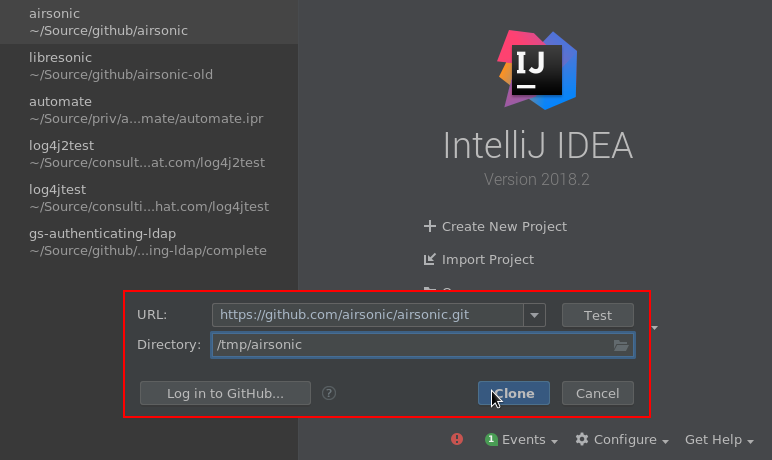
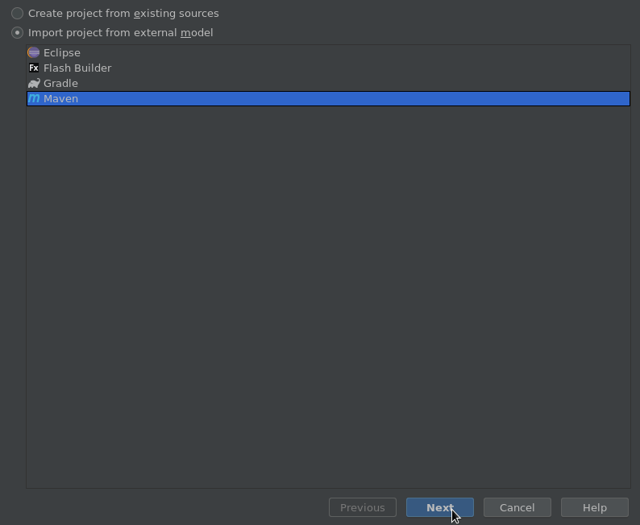
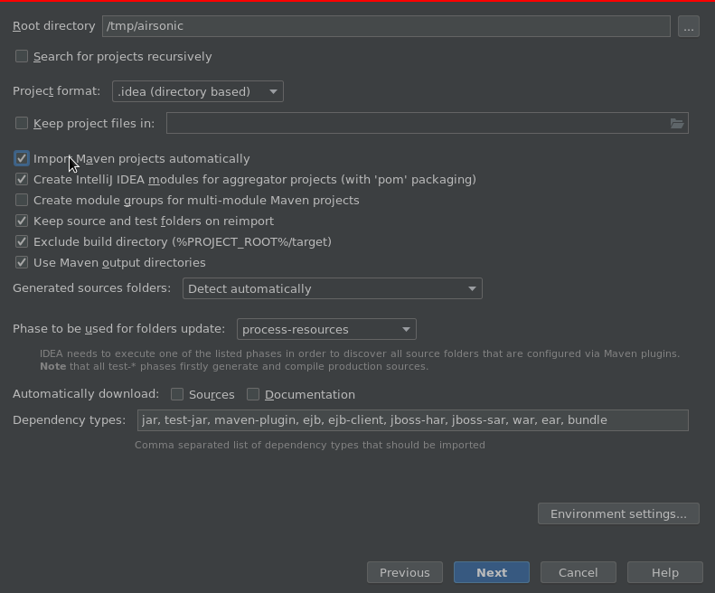
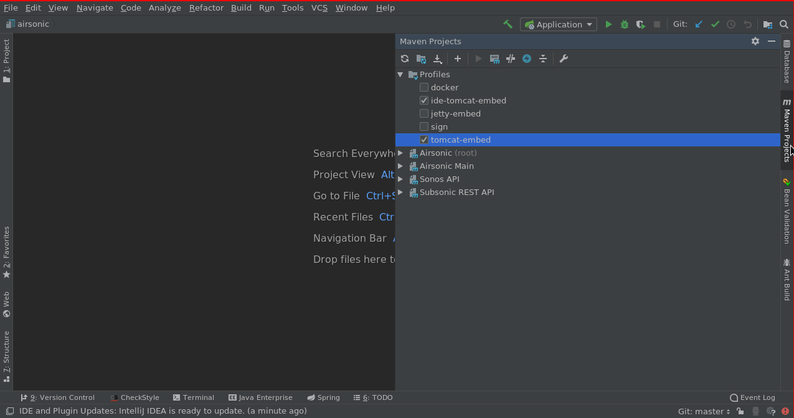
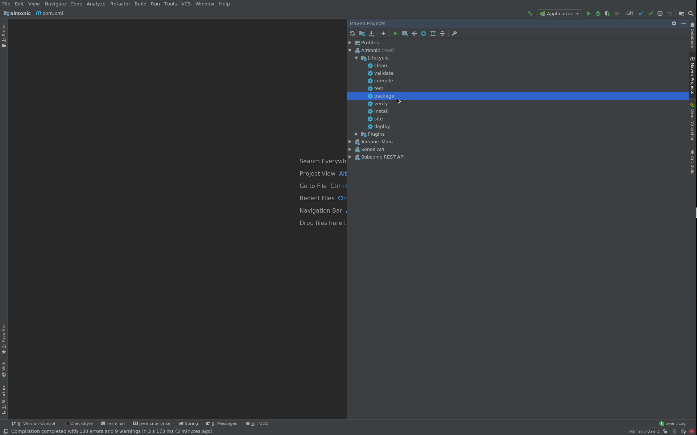
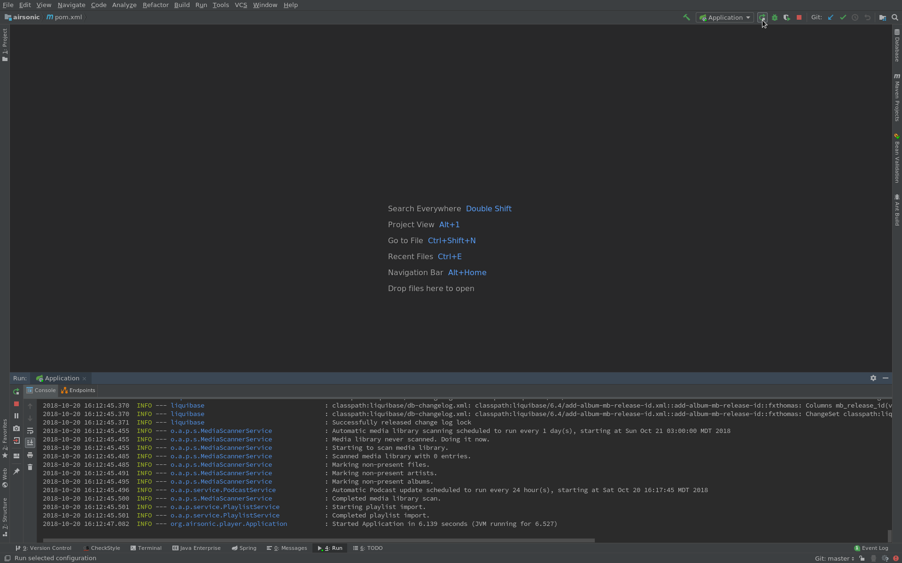
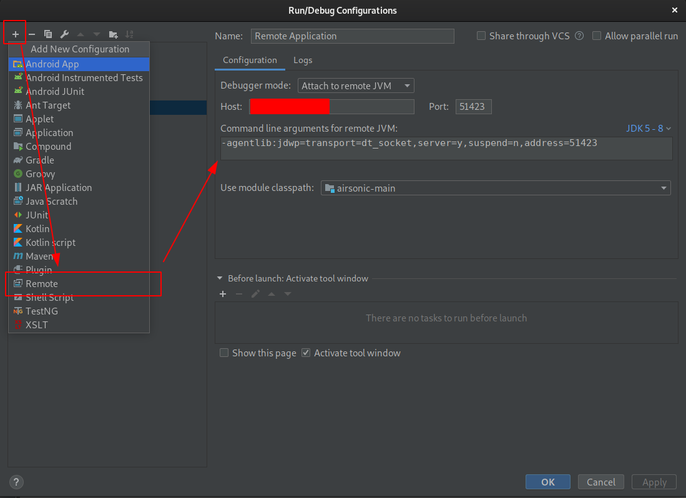

# Setting up IntelliJ IDE

For developing with Intellij (running and debugging), there are two options listed below.

::: tip NOTE
Intellij Ultimate 2018.2 was used for these instructions. Intellij Community 2018.2 should work fine for the first option. The second requires Ultimate
:::

## Use embedded Spring Boot

In the new project dialog, click `Check out from Version Control`:


Enter in the url for the airsonic source code, and click `Clone`:



Import project using `Maven`:



Check `Import Maven projects automatically` and click `Next`:



In the remaining dialog boxes, the default options are fine. Click next through them. At this point you should see intellij load up.

At the right side of the window, expand `Maven Projects` and ensure both `ide-tomcat-embed` and `tomcat-embed` profiles are checked:



Expand the `Airsonic (root)` and Lifecycle tree and run `package`:



Edit the runtime profiles. There should already be a Spring Boot runtime profile called `Application`. If not, create it by locating the `org.airsonic.player.Application` class and clicking the green play button next to the class name.

Once it exists, expand the Environment section and ensure `Include dependencies with "Provided"` scope is unchecked. Set the `Working directory` to the location of the `airsonic-main` subdirectory. Also if you want to change your `airsonic.home` do so now by adding `-Dairsonic.home=YOUR_DIRECTORY` to the VM options.

Click `Ok`.


Now you can run or debug the application:



## Use external Spring Boot

IntelliJ can be used as a remote debugger on a running server, which can come in handy.

::: warning NOTE
This degrades performance slightly while the debugger is attached.
:::

First, follow the instructions in the last part to setup IntelliJ locally.

Then, on the remote server, edit the Java command line used to run Airsonic and add the following options:

```
java -jar airsonic.war
    ...other options...
    -agentlib:jdwp=transport=dt_socket,server=y,suspend=n,address=*:51423
```

::: warning WARNING
This exposes port 51423 without any password. This must **never** be exposed outside of your local network. Enabling remote debugging allows remote control of anything on your server!
:::

Once this is done, in IntelliJ, open a new configuration and fill the name of your remote server, along with port 51423:


